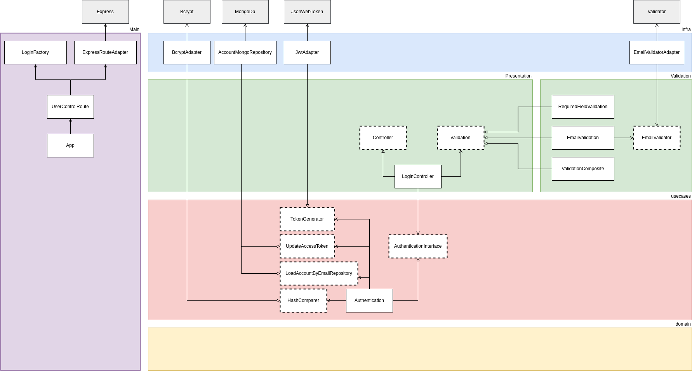

# Login

## Casos de sucesso: 
1. :heavy_check_mark: Recebe uma requisição do tipo **POST** na rota **/api/login**
1. :heavy_check_mark: Valida dados obrigatórios: **email** e **password**
1. :heavy_check_mark: Valida que o campo **email** é um email válido
3. :heavy_check_mark: Busca o usuário com o email e senha fornecido 
4. :heavy_check_mark: Gera um token de acesso a partir do ID do usuário 
5. :heavy_check_mark: Atualiza os dados do usuário com o token de acesso gerado
6. :heavy_check_mark: Retorna 200 com o token de acesso

## Exceções:
1. :heavy_check_mark: Retorna erro 404 se a API não existir
1. :heavy_check_mark: Retorna erro 400 se **email** ou **password** não forem fornecidos pelo client
1. :heavy_check_mark: Retorna erro 400 se o campo **email** for um email inválido
1. :heavy_check_mark: Retorna erro 401 se o não encontrar um usuário com os dados fornecidos
1. :heavy_check_mark: Retorna erro 500 se der erro ao tentar gerar o token de acesso 
1. :heavy_check_mark: Retorna erro 500 se der erro ao tentar atualizar o usuário com o token de acesso gerado